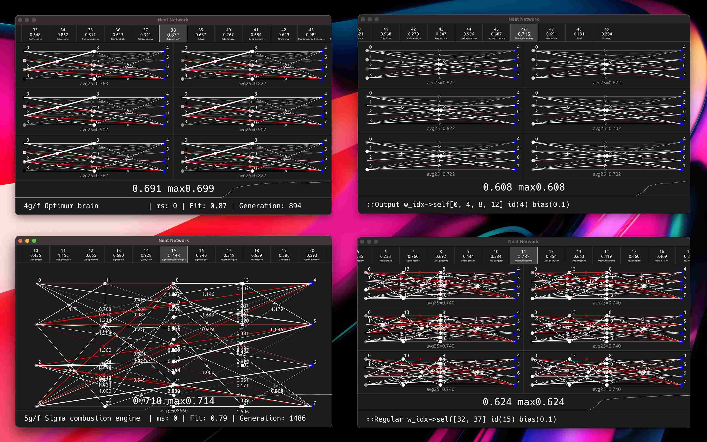

NEAT stands for `NeuroEvolution of Augmenting Topologies`. It is a method of evolving artificial neural networks with a genetic algorithm. It is a method of optimizing neural networks that is different from backpropagation.

###### Visualization of 3 diffrent ***NEAT*** species, and one ***NEAT*** network (bottom left).
