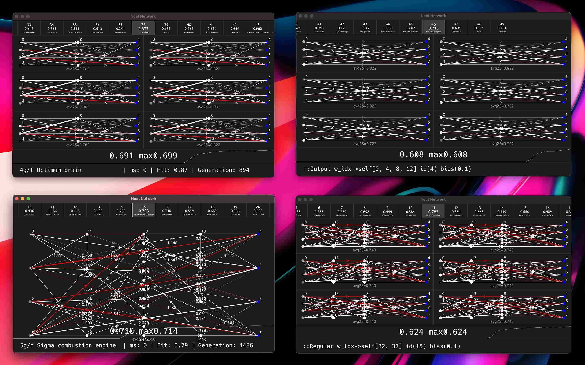

# NeuroEvolution of Augmenting Topologies

NEAT stands for `NeuroEvolution of Augmenting Topologies`. It is a method of evolving artificial neural networks with a genetic algorithm. It is a method of optimizing neural networks that is different from backpropagation.


###### Visualization of 3 diffrent ***NEAT*** species, and one ***NEAT*** network (bottom left).

## How to master the game snake
First of all, create a file in the `/src/games/` folder and name it `snake.rs` or whatever you'd like. 

Inside of the folder you can create a game evaluator, which each network will run. The game evaluator needs to implement the `FitnessEvaluator` trait, which requires you to implement the `run` method. It returns an f32 determining how good the network performed. 

```rust
// Simplified fitness evaluation for the game of snake
impl FitnessEvaluator for SnakeGameEvaluator {
    fn run(&mut self, network: &mut NeatNetwork) -> f32 {
        let mut total_score: f32 = 0.0;
        let mut board = Board::new();

        loop {
            // Feed the network some input vector. For the snake game
            // i feed the network two floats for the snake head position,
            // two for the apple position, and four for the proximity
            // around the snake head (1.0 = solid, 0.0 = empty tile).
            let decision = network.calculate_output(some_input);
            board.snake.move(decision);

            if board.snake.dead() { break; }
        }

        // Final score for this network
        board.apples_eaten()
    }
}
```
This is an oversimplification of how I implemented a snake game evaluator. We often need to convert the output vector from the network (`decision` variable in this case) to something more useful. This network in particular has 4 output nodes, indicating up, right, down and left. The output node with the highest value indicates what the next move will be.

### Network and evolution initialization
How we initialize our `Evolution` depends on the game and problem we're trying to solve. Here's the `Evolution` config I used to train the genomes to learn the game of snake:

```rust
let evolution = Evolution::new()
    // 25 species
    .batch_size(25)
    // 6 networks per species
    .with_species_size(6)
    // 2 for head pos, 2 for apple pos, 4 for head proximity
    .with_input_nodes(8)
    // How many hidden neurons all networks will initialize with
    .preestablish_hidden_neurons(4)
    // One for each direction (up, right, down, left)
    .with_output_nodes(4)

    // Replaces the worst performing network with a clone of
    // the best performing every 100th generation (some networks
    // can be quite slow when it comes to learning)
    .replace_worst_every_nth_gen(Some(100))

    // Read about traditional feed forward neural networks if
    // you are unsure what activation functions to use or what 
    // they are. However these two tend to work nicely together.
    .with_hidden_activation(Activation::LeakyRelu)
    .with_output_activation(Activation::Sigmoid)

    // If we want to connect every node to eachother on network
    // initialization, speeding up the proccess so we won't have
    // to wait for mutations to occur. (Can be good to turn of
    // if looking to minimize network size / complexity)
    .preestablish_connections(true)

    // The fitness evaluator, or the game that we want to train on
    .set_fitness_evaluator(SnakeGameEvaluator)
    .build();

// Launch a window visualizing all networks evolving
start_debug_display(evolution);
```
---
## Why?
I'm interested in biology and AI. So I decided to challenge myself to build a genetic algorthm. It is certainly not perfect, but I managed to make it work. 